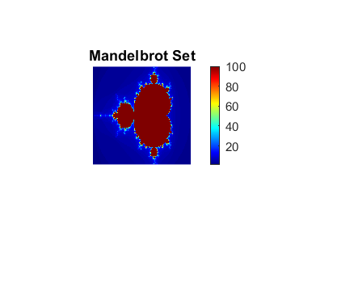
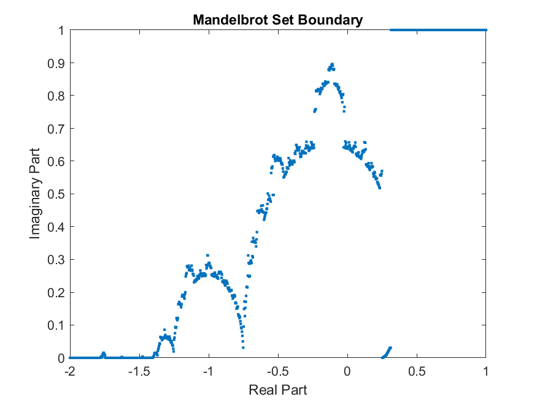
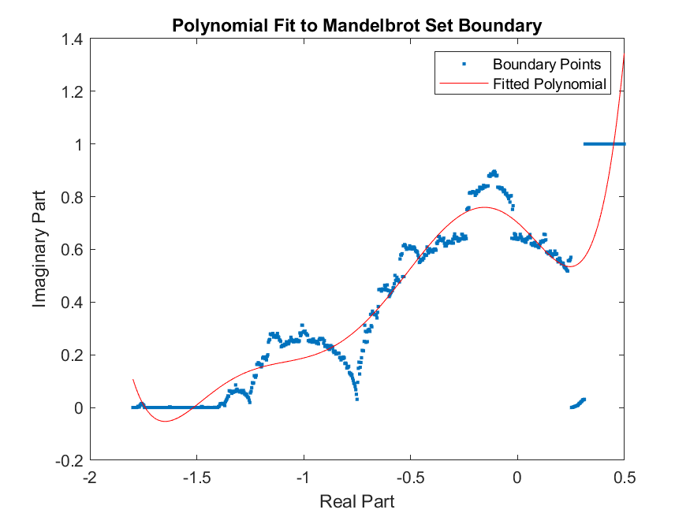

# Mandelbrot Set Boundary Analysis

## Overview

This project implements a comprehensive analysis of the Mandelbrot set's boundary using MATLAB. It visualizes the Mandelbrot set, approximates its boundary, fits a polynomial to the boundary, and calculates the boundary's length.

## Features

- Mandelbrot set visualization
- Boundary approximation using the bisection method
- Polynomial fitting to the boundary
- Calculation of the boundary length

## File Structure

- `mandelbrot_boundary_analysis.m`: Main script containing all functions and analysis steps
- `mandelbrot_results/`: Directory containing output files
  - `mandelbrot_set.png`: Visualization of the Mandelbrot set
  - `boundary_points.png`: Plot of the approximated boundary points
  - `polynomial_fit.png`: Plot of the polynomial fit to the boundary
  - `results.txt`: Text file with boundary length and polynomial coefficients
  - `workspace.mat`: MATLAB workspace variables

## Requirements

- MATLAB R2019b or later (or Octave 5.2.0 or later)

## Usage

1. Ensure you have MATLAB or Octave installed.
2. Download `mandelbrot_boundary_analysis.m`.
3. Open MATLAB/Octave and navigate to the directory containing the script.
4. Run the script: ```mandelbrot_boundary_analysis```
5. Results will be saved in the `mandelbrot_results` folder.

## Functions

### `fractal(c)`
Computes the number of iterations until divergence for a given complex point in the Mandelbrot set.

### `bisection(fn_f, s, e)`
Implements the bisection method to find the point where a function changes sign.

### `poly_len(p, s, e)`
Calculates the length of a polynomial curve between two points.

## Implementation Details

1. **Mandelbrot Set Visualization**: 
- Uses a 200x200 grid
- Range: -2.0 to 1.0 (real), -1.0 to 1.0 (imaginary)

2. **Boundary Approximation**:
- Uses bisection method on 1000 points
- Range: -2 to 1 (real axis)

3. **Polynomial Fitting**:
- Fits a 15th order polynomial
- Excludes flat parts of the boundary

4. **Boundary Length Calculation**:
- Integrates the fitted polynomial

## Results

### Mandelbrot Set Visualization


This image shows the classic Mandelbrot set visualization, with different colors representing the number of iterations before divergence.

### Boundary Points


This plot shows the approximated boundary points of the Mandelbrot set, obtained using the bisection method.

### Polynomial Fit


This graph displays the 15th order polynomial fit (red line) to the boundary points (blue dots) of the Mandelbrot set.

### Boundary Length
The approximate length of the Mandelbrot set boundary: 2.2973

This value represents the estimated length of the Mandelbrot set's boundary, calculated by integrating the fitted polynomial curve.

## Notes

- Ensure sufficient memory for large computations
- Adjust parameters in the script for different resolutions or ranges

## Author

Amol Arora

## Date

October 4, 2024